# Recursive AST Parsing - Mermaid Diagrams (Groovy)

## 1. Main Recursive Parsing Flow

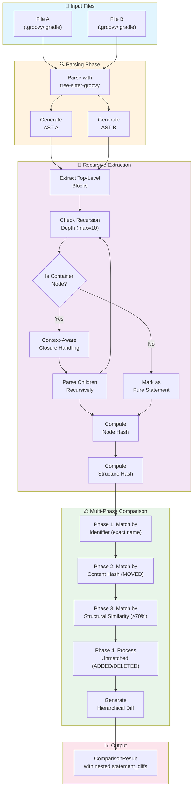

## 2. Container vs Pure Statement Decision (Groovy)

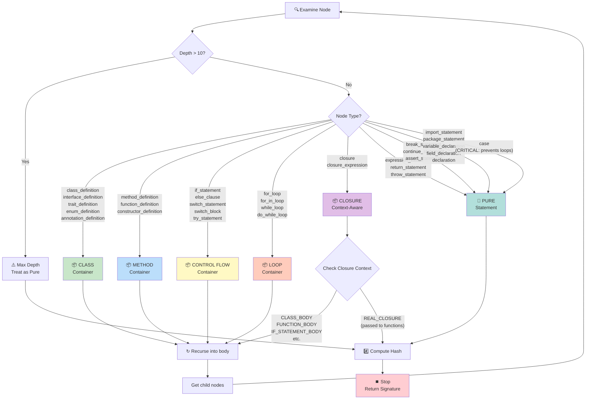

## 3. Groovy Code Block Hierarchy

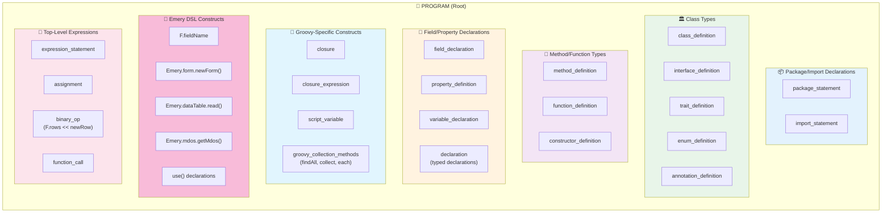

## 4. Inside Class/Method Body - Nested Blocks

```mermaid
flowchart TD
    subgraph BODY["📦 CLASS/METHOD BODY"]
        direction TB
        
        subgraph VARS["Variables & Fields"]
            V1["def/var declarations"]
            V2["field_declaration"]
            V3["assignment"]
            V4["typed declarations<br/>(USER_PROFILE_FORM obj = ...)"]
        end
        
        subgraph CONTROL["Control Flow"]
            IF["if_statement"]
            SWITCH["switch_statement"]
            TRY["try_statement"]
            IF --> IF_BRANCHES["Branch-Aware Analysis:<br/>• if condition + body<br/>• else if branches<br/>• else branch"]
            SWITCH --> SWITCH_BODY["switch_block<br/>• case<br/>• switch_default"]
            TRY --> TRY_BODY["body<br/>catch_clause<br/>finally_clause"]
        end
        
        subgraph LOOPS["Loops"]
            FOR["for_loop"]
            FORIN["for_in_loop"]
            WHILE["while_loop"]
            DO["do_while_statement"]
        end
        
        subgraph NESTED["Nested Classes/Methods"]
            NC["class_definition"]
            NM["method_definition"]
            NF["function_definition"]
        end
        
        subgraph CLOSURES["Groovy Closures & Collections"]
            FINDALL["list.findAll { condition }"]
            COLLECT["list.collect { transform }"]
            EACH["list.each { action }"]
            MAP_OPS["map.collectEntries { }"]
            STANDALONE["{ closure_body }"]
        end
        
        subgraph EMERY["Emery DSL Operations"]
            FORM_OPS["Form Operations<br/>F.fieldName access"]
            DATA_OPS["Data Table Operations<br/>Emery.dataTable.*"]
            MDOS_OPS["MDOS Operations<br/>Emery.mdos.*"]
            TEST_OPS["Test Operations<br/>Emery.test.*"]
        end
        
        subgraph PURE["Pure Statements ✓"]
            EXP["expression_statement"]
            RET["return_statement"]
            THR["throw_statement"]
            BRK["break/continue"]
            ASS["assert_statement"]
        end
    end
    
    style VARS fill:#fff9c4
    style CONTROL fill:#ffccbc
    style LOOPS fill:#d1c4e9
    style NESTED fill:#bbdefb
    style CLOSURES fill:#c8e6c9
    style EMERY fill:#f8bbd9
    style PURE fill:#b2dfdb
```

## 5. Multi-Phase Block Matching Strategy

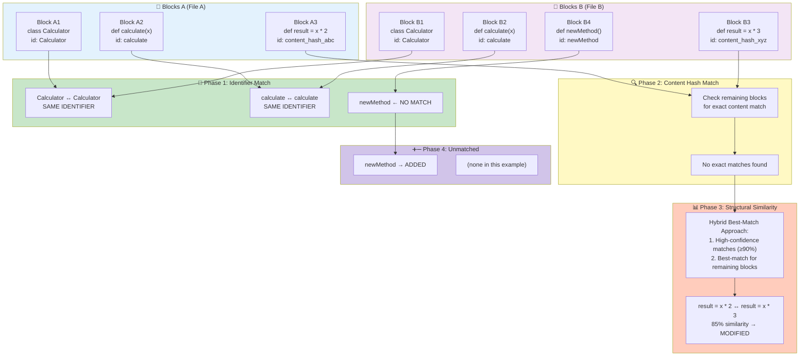

## 6. Groovy-Specific Enhancements

```mermaid
flowchart TD
    subgraph ENHANCEMENTS["🎯 Groovy-Specific Enhancements"]
        
        subgraph CLOSURE_COMBO["🔗 Closure Method Call Combination"]
            PROBLEM["PROBLEM:<br/>def filtered = list.findAll { it > 0 }<br/>Parsed as separate nodes"]
            SOLUTION["SOLUTION:<br/>Detect & combine method + closure<br/>into single statement"]
            RESULT["RESULT:<br/>Complete semantic unit preserved"]
        end
        
        subgraph TYPED_DECL["📝 Typed Declaration Handling"]
            EMERY_PROBLEM["PROBLEM:<br/>USER_PROFILE_FORM formObj = ...<br/>Split into identifier + assignment"]
            EMERY_SOLUTION["SOLUTION:<br/>Detect type + assignment pattern<br/>Combine into synthetic signature"]
            EMERY_RESULT["RESULT:<br/>Full typed declaration captured"]
        end
        
        subgraph BRANCH_AWARE["🌿 Branch-Aware If Analysis"]
            IF_PROBLEM["PROBLEM:<br/>if/else if/else treated as single block"]
            IF_SOLUTION["SOLUTION:<br/>Extract individual branches<br/>Compare like JavaScript POC"]
            IF_RESULT["RESULT:<br/>Branch-level change detection"]
        end
        
        subgraph EMERY_DSL["🔮 Emery DSL Support"]
            DSL_FEATURES["• F.fieldName access<br/>• Binary operations (<<)<br/>• Dotted function calls<br/>• Custom type declarations"]
            DSL_HANDLING["Context-aware parsing<br/>Enhanced identifier extraction"]
        end
    end
    
    PROBLEM --> SOLUTION
    SOLUTION --> RESULT
    EMERY_PROBLEM --> EMERY_SOLUTION
    EMERY_SOLUTION --> EMERY_RESULT
    IF_PROBLEM --> IF_SOLUTION
    IF_SOLUTION --> IF_RESULT
    DSL_FEATURES --> DSL_HANDLING
    
    style CLOSURE_COMBO fill:#c8e6c9
    style TYPED_DECL fill:#fff9c4
    style BRANCH_AWARE fill:#ffccbc
    style EMERY_DSL fill:#f8bbd9
```

## 7. Recursive Comparison Algorithm (Groovy)

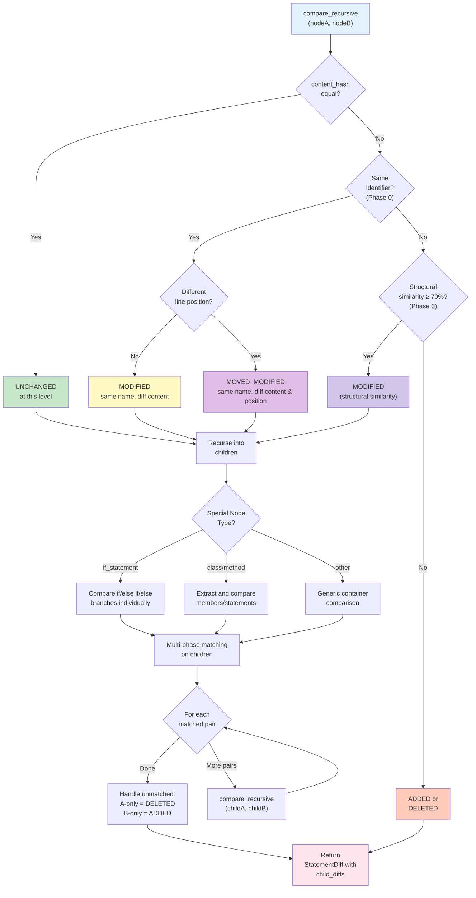

## 8. Groovy Node Type Classifications

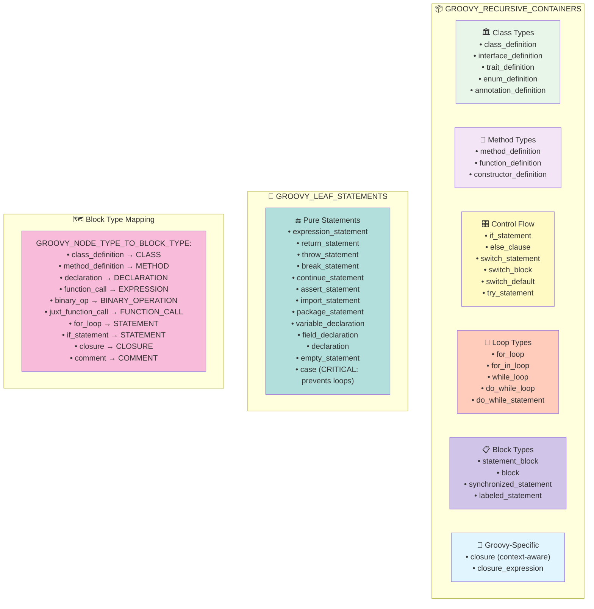

## 9. File Extension Support

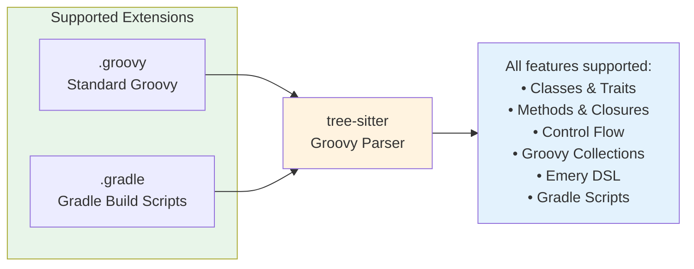

## 10. Complete Processing Pipeline

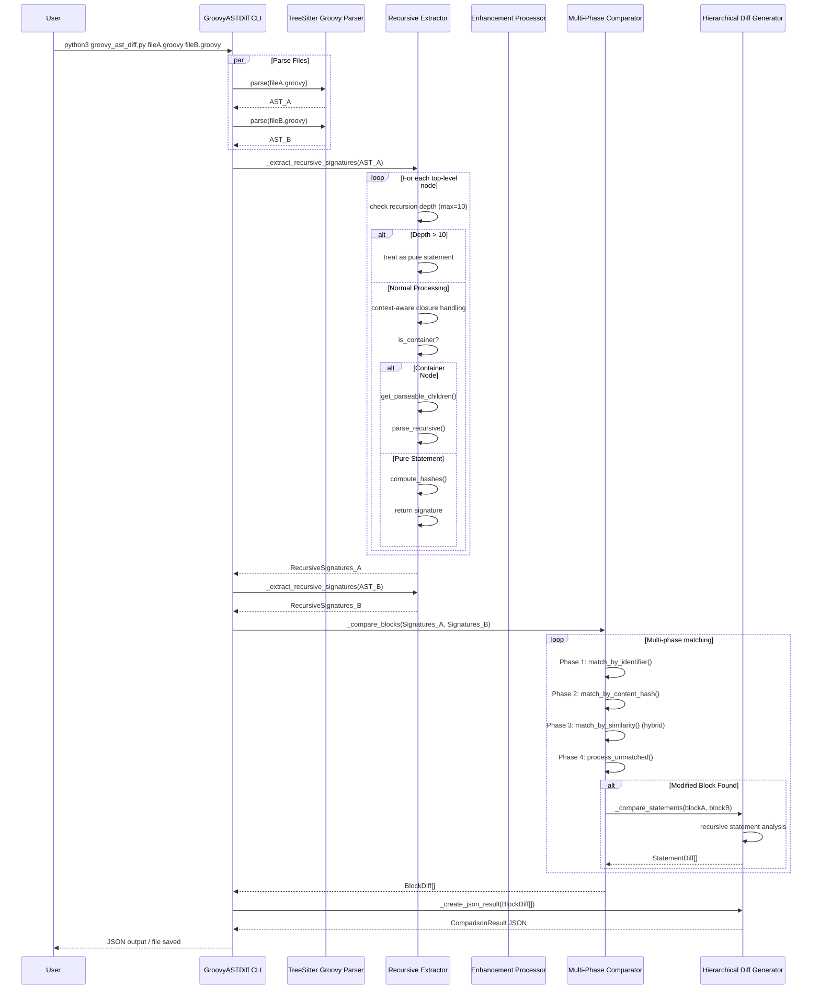

## 11. Data Structures (Groovy Implementation)

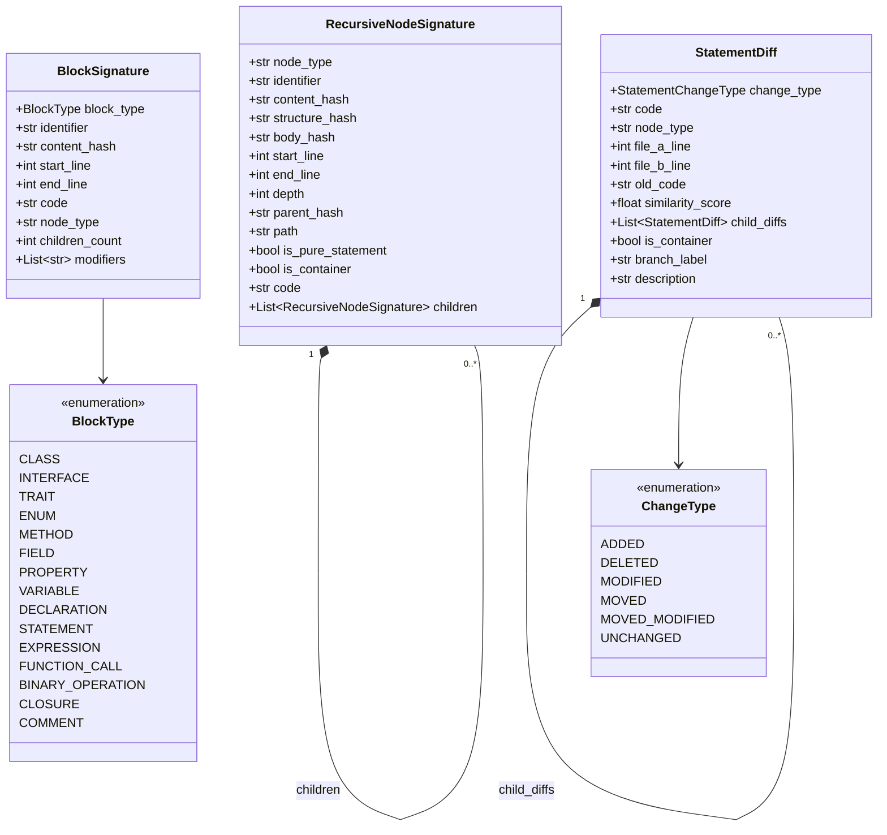

## 12. Emery DSL Pattern Recognition

```mermaid
flowchart TD
    subgraph EMERY_PATTERNS["🔮 Emery DSL Pattern Recognition"]
        
        subgraph FIELD_ACCESS["Field Access Patterns"]
            F_SIMPLE["F.fieldName"]
            F_NESTED["F.skillsMultiRow.rows"]
            F_BINARY["F.skillsMultiRow.rows << newRow"]
        end
        
        subgraph FUNCTION_CALLS["Function Call Patterns"]
            EMERY_FORM["Emery.form.newForm('TYPE')"]
            EMERY_DATA["Emery.dataTable.read('TABLE')"]
            EMERY_MDOS["Emery.mdos.getMdosDisplayValuesClob()"]
            EMERY_TEST["Emery.test.assertEquals(expected, actual)"]
        end
        
        subgraph TYPED_DECLARATIONS["Typed Declaration Patterns"]
            USER_FORM["USER_PROFILE_FORM formObj = ..."]
            EMPLOYEE_FORM["EMPLOYEE_FORM empForm = ..."]
            CUSTOM_TYPE["CUSTOM_TYPE variable = ..."]
        end
        
        subgraph USE_STATEMENTS["Use Statement Patterns"]
            USE_UTIL["use('EMERY_UTILITIES')"]
            USE_FORM["use('EMERY_FORM_OPERATIONS')"]
        end
    end
    
    subgraph AST_HANDLING["🎯 AST Handling Strategy"]
        F_SIMPLE --> DOTTED_ID["dotted_identifier"]
        F_NESTED --> MEMBER_ACCESS["member_access"]
        F_BINARY --> BINARY_OP["binary_op<br/>(left-hand extraction)"]
        
        EMERY_FORM --> FUNC_CALL["function_call<br/>(dotted function)"]
        EMERY_DATA --> FUNC_CALL
        EMERY_MDOS --> FUNC_CALL
        EMERY_TEST --> FUNC_CALL
        
        USER_FORM --> COMBINED_DECL["Combined Declaration<br/>(synthetic signature)"]
        EMPLOYEE_FORM --> COMBINED_DECL
        CUSTOM_TYPE --> COMBINED_DECL
        
        USE_UTIL --> SIMPLE_FUNC["function_call"]
        USE_FORM --> SIMPLE_FUNC
    end
    
    style FIELD_ACCESS fill:#e1f5fe
    style FUNCTION_CALLS fill:#f3e5f5
    style TYPED_DECLARATIONS fill:#fff9c4
    style USE_STATEMENTS fill:#e8f5e9
    style AST_HANDLING fill:#f8bbd9
```

## 13. Visual Example: Groovy Class Modification

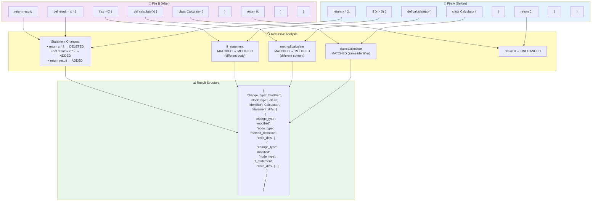

---

## Implementation Summary

### Current Groovy Recursive Parsing Implementation

This documentation reflects the actual implementation in GroovyRecursiveParser and GroovyASTDiff as of the latest codebase analysis.

#### Core Features

1. **Depth Limiting (max_depth=10)**
   - Critical safety mechanism to prevent infinite recursion
   - Nodes beyond max depth are treated as pure statements
   - Configurable parameter with sensible default

2. **Context-Aware Closure Handling**
   - `_get_closure_context()` determines closure behavior
   - Structural closures (CLASS_BODY, FUNCTION_BODY, etc.) → Containers (recurse)
   - Functional closures (REAL_CLOSURE) → Pure statements (stop recursion)
   - Prevents infinite loops while maintaining accuracy

3. **Multi-Phase Matching Strategy**
   - **Phase 1**: Match by identifier (exact name match)
   - **Phase 2**: Match by content hash (exact content → MOVED)
   - **Phase 3**: Match by structural similarity (≥70% → MODIFIED)
   - **Phase 4**: Process unmatched blocks (ADDED/DELETED)

4. **Accurate Node Classifications**
   - `GROOVY_RECURSIVE_CONTAINERS`: Containers that need recursion
   - `GROOVY_LEAF_STATEMENTS`: Pure statements that stop recursion
   - Special handling: `case` statements are leaf nodes (prevents infinite loops)

#### Key Differences from JavaScript Implementation

1. **No Zhang-Shasha Algorithm**: Uses custom similarity calculation
2. **Context-Aware Closures**: JavaScript doesn't have this concept
3. **Groovy-Specific Node Types**: Different tree-sitter grammar
4. **Emery DSL Support**: Domain-specific language handling
5. **Manual Traversal**: No tree-sitter queries, uses manual node traversal

#### Recursion Protection Mechanisms

1. **Max Depth Limiting**: Prevents runaway recursion
2. **Case Statement Classification**: Prevents infinite loops in switch statements
3. **Context-Aware Closures**: Functional closures don't recurse
4. **Leaf Node Detection**: Pure statements immediately stop recursion

#### Performance Optimizations

1. **Early Termination**: Pure statements stop recursion immediately
2. **Hash-Based Comparison**: Content and structure hashes for efficiency
3. **Context Caching**: Closure contexts computed once and reused
4. **Depth Tracking**: Efficient depth management during traversal

This implementation provides robust, context-aware recursive parsing for Groovy with proper handling of closures, Emery DSL constructs, and comprehensive recursion protection.

---

## Usage

These Mermaid diagrams can be rendered in:
- GitHub README/Markdown files
- GitLab README/Markdown files
- VS Code with Mermaid extensions
- Obsidian
- Notion
- Any Mermaid-compatible viewer

To view locally, you can use:
```bash
# Install mermaid-cli
npm install -g @mermaid-js/mermaid-cli

# Generate PNG/SVG
mmdc -i recursive_parsing_mermaid.md -o groovy_ast_diff_diagrams.png
```

## Key Differences from JavaScript Implementation

1. **Groovy-Specific Node Types**: Uses actual tree-sitter-groovy node types (e.g., `for_loop` instead of `for_statement`)
2. **Context-Aware Closure Handling**: Distinguishes structural blocks from functional closures using `_get_closure_context()`
3. **Emery DSL Support**: Specialized handling for custom DSL constructs (uses standard Groovy node mappings)
4. **Depth Limiting**: Configurable max_depth (default 10) with safety mechanisms
5. **Case Statement Protection**: `case` nodes are leaf statements to prevent infinite recursion
6. **Multi-Phase Matching**: 4-phase strategy with custom similarity calculation (no Zhang-Shasha)
7. **Manual Traversal**: Uses `_get_parseable_children()` instead of tree-sitter queries
8. **Method+Closure Combination**: Limited combination logic for Groovy collection methods (not a separate phase)